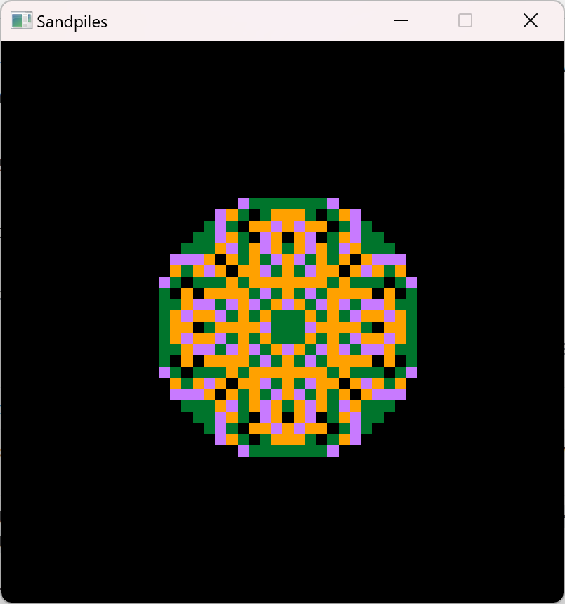

# **SANDPILE**

This is based on the Youtube video:

https://www.youtube.com/watch?v=SfWWaZ1AoQE

The original project is in C and uses the Raylib lib.

Adapted/(Translated) to GO using the **Raylib-go** lib.

### **What the program does:**

*If all tiles have less that 4 grains of sand the sandpile is stable*

*If at least one vertex is unstable.*

*The whole configuration  is said to be unstable.*

*In this case, choose any unstable vertex at random.*

*Topple this vertex by reducing its grain number by four and by increasing the grain numbers of each of its (at maximum four) direct neighbors by one.*

*https://en.wikipedia.org/wiki/Abelian_sandpile_model*

### **Prerequisites:**

To be able to use Raylib on Windows 11, you would need to install a *C compiler*.
Recommended C compiler :
Mingw-w64
It needs to be in your Windows path.

You then need to get the raylib package.

go get -v -u github.com/gen2brain/raylib-go/raylib

Youtube tutorial to setup Raylib and gcc for Windows:

https://www.youtube.com/watch?v=VT18uh4t_rs

*This is just a playful algorithm to learn GO*

**Note:**

Implemented on 29/03/2024.

go version go1.21.8

gcc version 8.1.0 (x86_64-posix-seh-rev0, Built by MinGW-W64 project).

Tested on Windows only.

To run it:

go run sandpile.go

To build the executable:

go build sandpile.go

